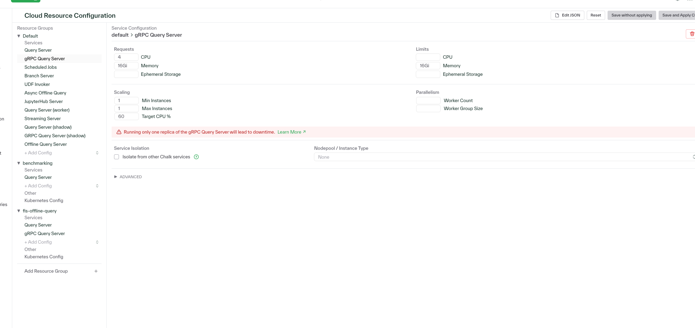

# Background

A customer writes in and says: 

> Sometimes when I query Chalk, I get a 503 UNAVAILABLE error from my GRPC client. Why?

After an investigation, you find this screenshot:

Please write a response to the customer explaining why this error occurs, and what they can do to avoid it in the future.
Please also include any relevant links to Chalk's documentation.